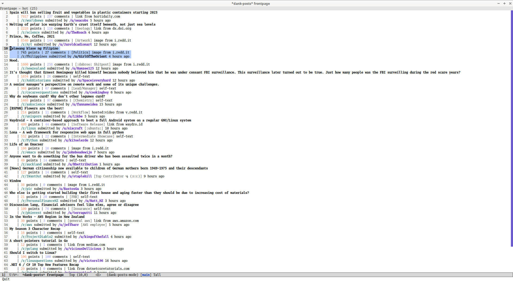
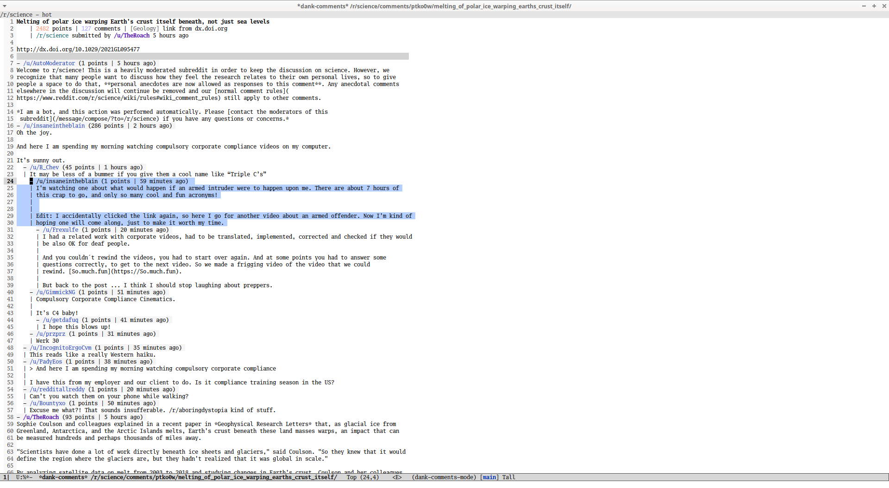
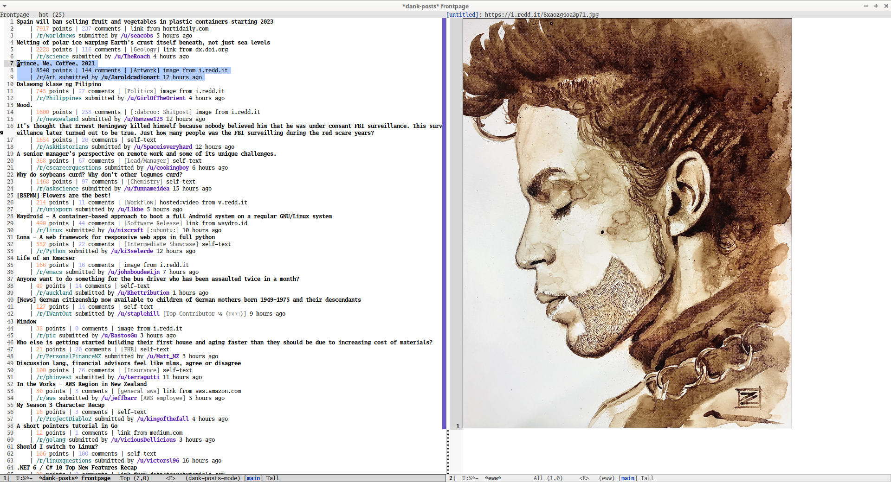

# dank-mode

Emacs major mode for browsing ~~dank memes~~ Reddit.

# Features and screenshots

- Load list of posts for your frontpage or a specific subreddit.
- Read comments for a post.
- Open posts and links in a browser or with EWW.
- Customizable faces.

# Install

This isn't ready for MELPA yet. To insall, download this repository
and put the files of `lisp/` in your load path.

## 3rd-party packages

This package requires the following packages:

- `s.el`
  - https://github.com/magnars/s.el (available on MELPA)
  - Parsing and formatting Reddit content means a lot of string
    operations and transformations. `s.el` provides some convenient
    methods for this.
- `request.el`
  - https://github.com/tkf/emacs-request (avaialble on MELPA)
  - Used for communicating with the Reddit API.
- `markdown-mode`
  - https://jblevins.org/projects/markdown-mode/ (available on MELPA)
  - Reddit content is mostly Markdown. It makes sense to use the
    Markdown package to help with formatting.

# Authentication

All requests to the Reddit API must be authenticated.

To authenticate, you will need to generate your own Reddit API client
id and secret.

This can be done via https://www.reddit.com/prefs/apps

Once you have your Reddit API client id and secret, save them in the
`dank-auth-file` file (defaults to `~/.emacs.d/dank-mode/auth.json`).

You will also need to provide your Reddit username and password in the
same file.[1]

See the sample file `auth.example.json` for an example of this
`dank-auth-file` file.

[1]: Ideally, you shouldn't have to provide your **plaintext password** to use this package. But to perform the complete OAuth2 dance with Reddit's servers, a client server will have to be running to receive the access tokens. This is planned for a future iteration.

# Usage instructions

Please make sure your `dank-auth-file` is available. See
**Authentication** section above.

## Quick tutorial

### Frontpage and subreddits

Open your frontpage with `M-x dank-mode`. This will create a new
buffer with the frontpage posts sorted by `hot` (the default).

This buffer will have the `dank-posts-mode` major mode enabled.
The "active" post under `point` will be highlighted.
Navigate between posts with `n` (down) and `p` (up).

To open the post link in your browser, press `C-x l b`. Alternatively,
to open the post link with `EWW`, press `C-x l l`.

To navigate to a specific subreddit, press `C-x C-f`. You will be
prompted to enter the subreddit name. A list of your subscribed
subreddits will be available for autocompletion, but specifying a
subreddit not in this list will also work.

Alternatively, to navigate to the subreddit under `point`, press `C-x
C-/`.

To load the next page, press `C-x C-v`. To refresh, press `C-x C-r`
(this will reset the page count).

To change the posts sorting, press `C-x C-s`.

### Comments

To read the comments of the active post, press `C-x C-o`. This will
create a new buffer in `dank-comments` mode for the post's comments.
Navigating between comments is done similarly with `n` and `p`.

To jump between sibling comments, press `M-n` or `M-p`.  To jump to
the parent comment, press `P` (`Shift-p`).

To load more comments, navigate to that "load more" comment and press
`C-x C-o`. If it's a small enough comment tree the comments will be
inserted into the current buffer. If it's not, the comment tree will
be opened in a new buffer.

To fold/unfold a comment tree, press `TAB`.

To quit the comment buffer and go back to the frontpage or subreddit
buffer, press `C-x q`.

### Other commands

To view the full list of commands, refer to the mode help page `C-x h m`.

# Roadmap

- [ ] Better auth (e.g. don't require providing password in plaintext)
- [ ] Multi-reddits
- [ ] Upvote/downvote posts and comments
- [ ] Reply in comments
- [ ] Submitting posts

## Maybe:

- Saving posts and comments
- Viewing the user's saved/upvoted/replied posts and comments

## Out of scope:

These are features I don't use and don't intend to implement anytime soon:

- moderating
- live threads
- polling
- private messages
